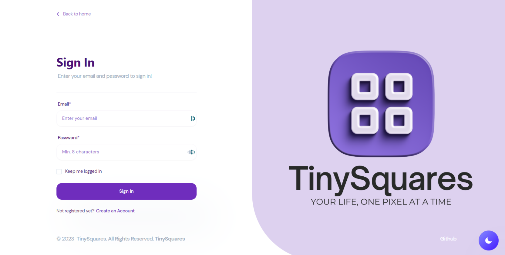
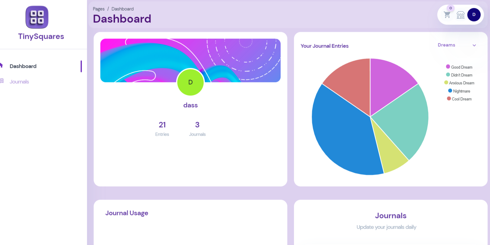

<a name="readme-top"></a>
<br />

 <div align="center">
 <h1 align="center">TinySquares</h1>

<a href="https://github.com/jason1chiu/tiny-squares">


</a>
<p align="center">
  Your Life, One Pixel at a Time
</p>

<br />
<details><summary>Table of Contents;</summary>

- [About the Project](#description)

- [Added Features](#features)

- [Installation](#installation)

- [Usage](#usage)

- [Contributing](#contributing)

<!-- - [Resources](#resources) -->

- [license](#license)

- [Questions](#questions)

</details>
</div>

<p align="right">(<a href="#readme-top">back to top</a>)</p>

<a name="description"></a>

## :rocket: About The Project

<p align="center">
 
  
</p>

<h3 align="center"> Introducing TinySquares: </h3>

Your ultimate destination for personalized lifestyle journals. Track sports, health, and mindfulness effortlessly. Our visually appealing pixel calendar design gives a clear year-long overview of your progress. Dive deeper with statistics and pie charts for insightful data representation. Join us and unlock your full potential 


## :star: Added Features

- Create and delete custom Pixel Journals
- Add and view friends
- Journal data collected and displayed in graphs
- Download image of your custom journal
- Badge system based on journal entries
- PWA feature, download the app locally

<p align="right">(<a href="#readme-top">back to top</a>)</p>

<a name="installation"></a>

## :hammer_and_wrench: Installation

1. Clone the repository

```bash
git clone https://github.com/jason1chiu/tiny-squares
```

2. Change the Working Directory

```bash
cd tiny-squares
```

<!-- 3. Install [`sequelize`](https://www.npmjs.com/package/inquirer), [`figlet`](https://www.npmjs.com/search?q=figlet), [`dotenv`](https://www.npmjs.com/package/dotenv), [`mysql2`](https://www.npmjs.com/package/mysql2), [`handlebars`](https://www.npmjs.com/package/handlebars) and [`express`](https://www.npmjs.com/package/console.table) [`chakra`](https://chakra-ui.com/)
 -->
3. Install [`chakra`](https://www.npmjs.com/package/@chakra-ui/react), [`react`](https://www.npmjs.com/package/react), [`apollo-server-express`](https://www.apollographql.com/docs/apollo-server/previous-versions/), [`bcrypt`](https://www.npmjs.com/package/bcrypt), [`express`](https://www.npmjs.com/package/console.table), [`jsonwebtoken`](https://www.npmjs.com/package/jsonwebtoken), [`mongoose`](https://www.npmjs.com/package/mongoose), [`dotenv`](https://www.npmjs.com/package/dotenv), [`stripe`](https://www.npmjs.com/package/stripe), and [`cors`](https://www.npmjs.com/package/cors)


```bash
npm i
```


4.  to https://tinysquares.herokuapp.com/ in your browser to access the site

<p align="right">(<a href="#readme-top">back to top</a>)</p>

<a name="usage"></a>

## :computer: Usage

<div align="center">
     
   </div>
   <br />
   

<div align="center">
  <h2><a href="https://tinysquares.herokuapp.com/" target="_blank">🌐 Deployed Website</a></h2>
  <p>Click the link above to explore our live application!</p>
  <a href="https://tinysquares.herokuapp.com/" target="_blank">
    
  </a>
</div>

<p align="right">(<a href="#readme-top">back to top</a>)</p>


<a name="contributing"></a>

## :handshake: Contributing

We welcome contributions to this project. Below is our team who has been working tirelessly to make this app come to life. Feel free to reach out to any of us on LinkedIn or GitHub.

---

### Jason Chiu

<div align="center">
    <a href="https://www.linkedin.com/in/chien-cheng-chiu-0a0930257/" target="_blank">LinkedIn</a> | 
    <a href="https://github.com/jason1chiu" target="_blank">GitHub</a>
</div>

---

### Cassie LeClair

<div align="center">
    <a href="https://www.linkedin.com/in/cassie-leclair-931093b6/" target="_blank">LinkedIn</a> | 
    <a href="https://github.com/cleclair71" target="_blank">GitHub</a>
</div>

---

### Calvin Trieu

<div align="center">
    <a href="https://www.linkedin.com/in/calvin-trieu/" target="_blank">LinkedIn</a> | 
    <a href="https://github.com/cntrieu" target="_blank">GitHub</a>
</div>

---

### Luba Mistys

<div align="center">
    | 
    <a href="https://github.com/lmintsys" target="_blank">GitHub</a>
</div>

---


<p align="right">(<a href="#readme-top">back to top</a>)</p>

<a name="license"></a>

## :clipboard: License

MIT

<p align="right">(<a href="#readme-top">back to top</a>)</p>

<!-- <a name="resources"></a> -->

<!-- ## :mag_right: Resources

- [Creating and Selecting a Database](https://dev.mysql.com/doc/refman/8.0/en/creating-database.html)
- [Handlebars](https://www.npmjs.com/package/handlebars)
- [Figlet](https://www.npmjs.com/package/figlet)
- [How To Create Interactive Command-line Prompts with Inquirer.js](https://www.digitalocean.com/community/tutorials/nodejs-interactive-command-line-prompts)
- [Canva](https://www.canva.com/)
- [Everything you should know about ‘module’ & ‘require’ in Node.js](https://www.freecodecamp.org/news/require-module-in-node-js-everything-about-module-require-ccccd3ad383/)
- [break](https://developer.mozilla.org/en-US/docs/Web/JavaScript/Reference/Statements/break)
- [ShieldsIO](https://shields.io/category/funding)
 -->
<!-- <p align="right">(<a href="#readme-top">back to top</a>)</p> -->

<a name="questions"></a>

## :mailbox_with_no_mail: Questions?

If you have any questions about this project, please don't hesitate to reach out to me. I'm always happy to help and provide additional information.

### How to Ask a Question

1. **Check the existing documentation:** Before asking a question, please take a moment to review the existing documentation. Your question may already be answered in the README file or other project documentation.

2. **Create a new issue:** If you can't find the answer to your question in the documentation, please create a new issue in the project's issue tracker. Be sure to provide as much detail as possible about your question, including any relevant code snippets or screenshots.


   <!-- <p align="center"> 
   <a href="https://github.com/cleclair71/hr-hub">My Repository</a>
   </p> -->

### :pray: Feedback and Suggestions

I welcome feedback and suggestions for this project. If you have ideas for how to improve the project, please feel free to create a new issue or contact me directly. Your input is greatly appreciated!

  <p align="right">(<a href="#readme-top">back to top</a>)</p>
